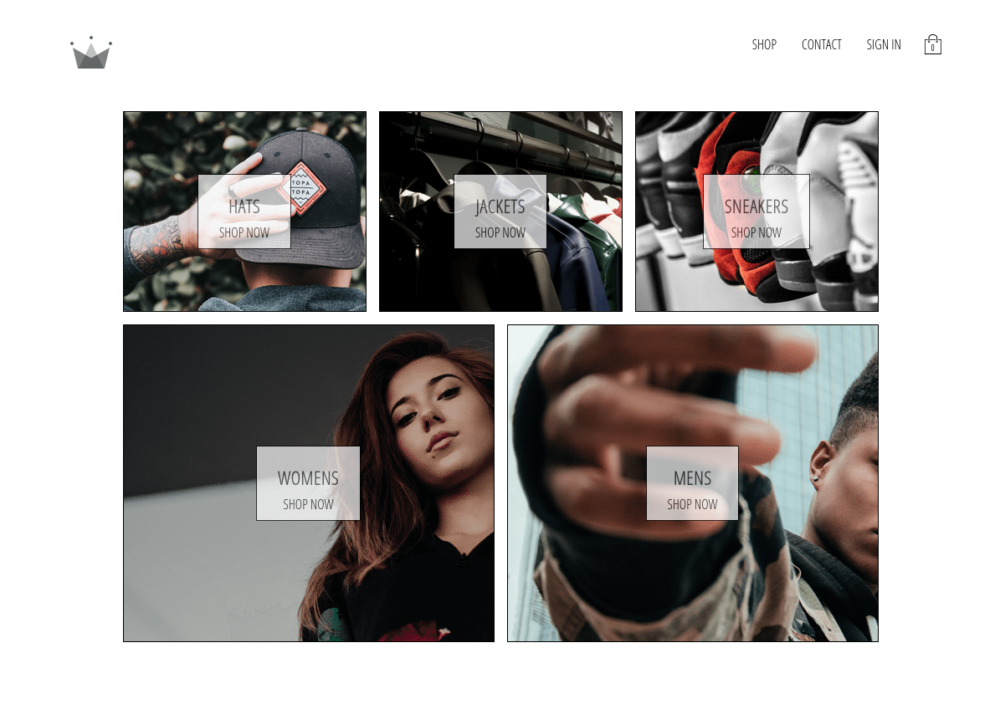
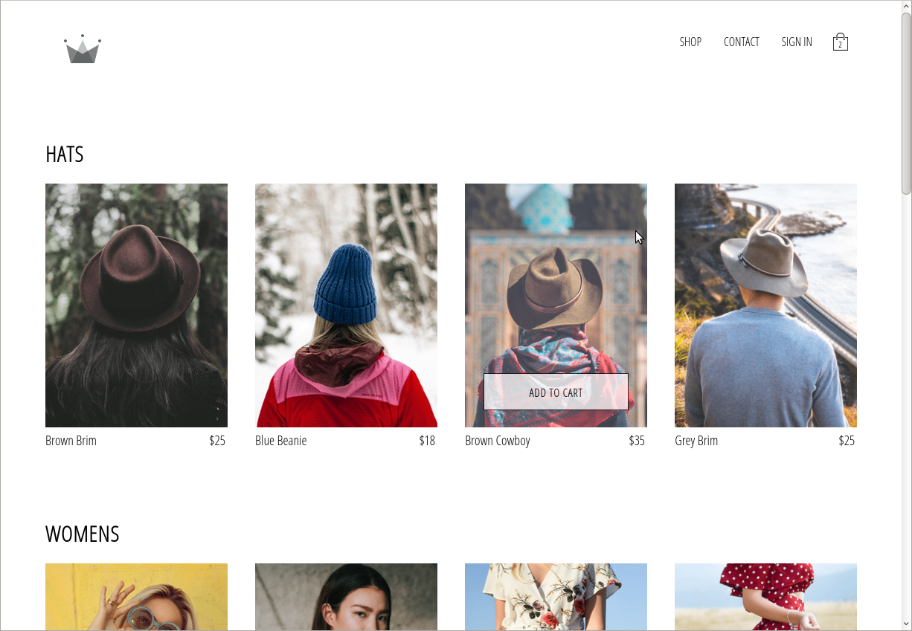
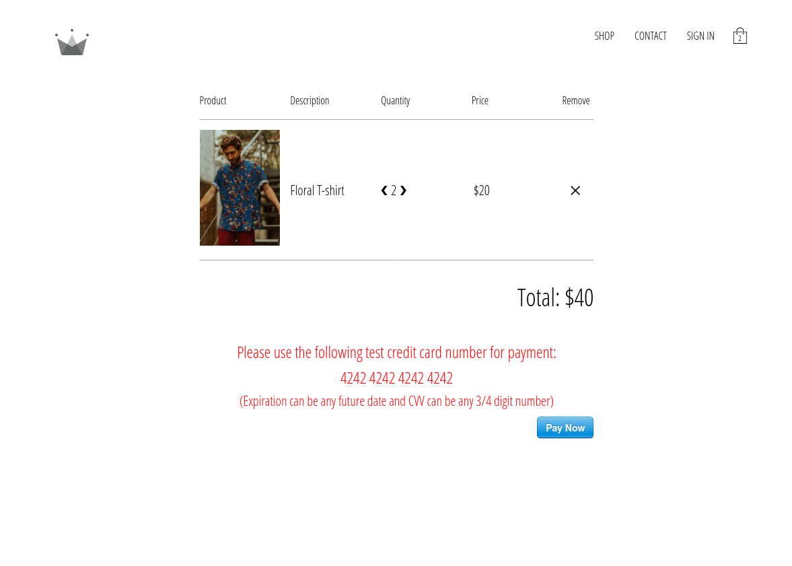
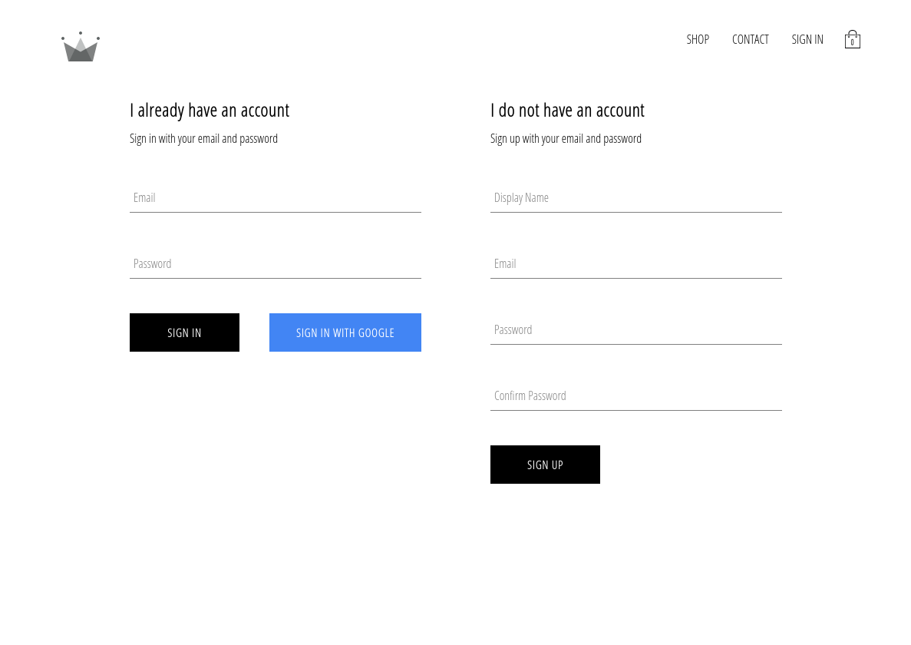
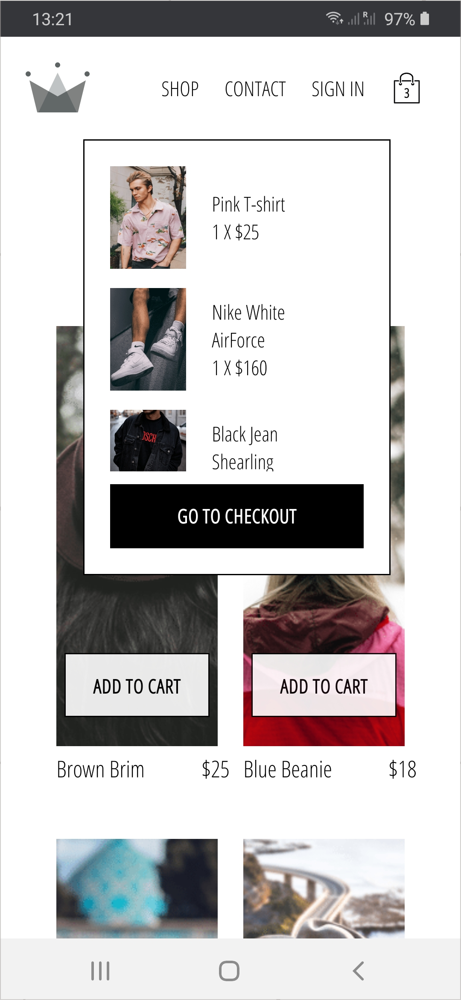

# ReactJS e-commerce miniproject

## What this project is

This is a project written in ReactJS simulating an e-commerce clothes shop that I coded along the following Udemy course: \
[Complete React Developer in 2020 (w/ Redux, Hooks, GraphQL) By Andrei Neagoie and Yihua Zhang](https://www.udemy.com/course/complete-react-developer-zero-to-mastery/).

Though I did code along the instructor, all the code written is entirely mine (no copy and paste!) and I often made my own decisions (most noticiably I aborred the CSS in JS topic which I listened to but refused to implement in my project, or a completely alternative implementation I did for the Redux Sagas).\
So I honestly would say that roughly 70% of the code/project can be attributed to the course's instructors and 30% of it can be attributed to my own efforts/decisions.
\
\
Furthermore I did and plan on doing extra personal bits of work on the project, as you can see in the [reposity's issues page](https://github.com/dario-piotrowicz/ReactJS_e-commerce-miniproject/issues?q=is%3Aissue+).

## Overall Description/Technologies Involved

The application is implemented using ReacJS, it's been created using the [Create-React-App](https://github.com/facebook/create-react-app) tool and:
- uses the [React Router](https://github.com/ReactTraining/react-router) (Dom) to implement pages routing
- uses [Firebase](https://firebase.google.com/) it implements authentication methods and data retrival (if you want to check the security rules set in firestore check the [security rules file](FIRESTORE_SECURITY_RULES.md))
- manages its local state using the [Redux](https://redux.js.org/) library
 (enhanced with [Redux-Saga](https://github.com/redux-saga/redux-saga))
- processes (test) payments via the [Stripe](https://stripe.com/gb) plaftorm \
 (in order to implement this an additional very small backend project was needed, you can see it in its own repository [here](https://github.com/dario-piotrowicz/NodeJS_e-commerce-miniproject-backend))
- uses functional components with the new [React Hooks](https://reactjs.org/docs/hooks-intro.html) instead of class components with lifecycle methods
- it is responsive thanks to the use of media queries and can be used as a Progressive Web App (the latter came practically out of the box thanks to Create-React-App)

## Screenshots
Follow some screenshots of the application:

* HomePage:

* Shop:

* Checkout: 

* Registration:

* As a Progressive Web App:

## Deployment
The application is deployed on the [Heroku](https://www.heroku.com/) platfrom and can be accessed via the following link:\
[ecomm-miniproject.herokuapp.com](https://ecomm-miniproject.herokuapp.com/).

